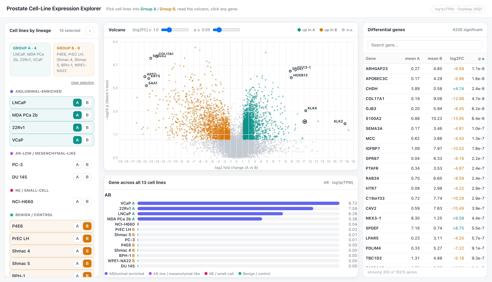

<div align="center">

# 🧬 Prostate Cell-Line Expression Explorer

### *An interactive, zero-dependency atlas of prostate-cancer cell-line gene expression*

<br/>

[](https://yangcui0612.github.io/prostate-cell-line-expression/)
[](https://yangcui0612.github.io/prostate-cell-line-expression/)
[](LICENSE)


<br/>

### 🌐 &nbsp; **[▶ &nbsp; yangcui0612.github.io/prostate-cell-line-expression](https://yangcui0612.github.io/prostate-cell-line-expression/)** &nbsp; 🌐

<sub>🇬🇧 [English](#-english) &nbsp;·&nbsp; 🇨🇳 [中文](#-中文) &nbsp;·&nbsp; 🇯🇵 [日本語](#-日本語)</sub>

<br/>

[](https://yangcui0612.github.io/prostate-cell-line-expression/)

</div>

---

## 🇬🇧 English

A single-page web app to **explore and compare gene expression across prostate-cancer cell lines** — pick lines into two groups, read a live volcano plot, sort the differential-gene table, and inspect any gene across all 13 lines. No install, no server, no dependencies.

### ✨ Features
- 🧬 **Lineage-grouped selector** — the 13 expression-ready lines are sorted into *AR/luminal-enriched*, *AR-low / mesenchymal-like*, *NE / small-cell*, and *benign / control*, so you can locate a model and know what it represents at a glance.
- 🅰️🅱️ **Free A / B grouping** — drop any cell lines into two groups and compare instantly.
- 🌋 **Interactive volcano** — log2 fold-change vs −log10 *p* (Welch t-test). Hover for a tooltip, click to pin a gene, top-10 hits auto-labeled, adjustable fold-change & *p* thresholds.
- 📊 **Sortable differential-gene table** — sort every column ascending/descending and search by gene symbol.
- 📈 **Per-gene bar chart** — click any gene to see its expression across **all 13 cell lines**, colored by lineage.
- ⚡ **Zero dependencies** — one HTML file + data; opens straight from disk, works offline.

### 🖱️ How to use
1. In the left panel, click **A** or **B** on cell lines to build two comparison groups.
2. Read the **volcano** — teal = up in A, amber = up in B. Hover or click a point.
3. Sort the **differential-genes** table or search a symbol on the right.
4. Click any gene to see the **per-line bar chart** at the bottom.

### 🧪 Data & honesty
- Source: **DepMap Public 26Q1** `OmicsExpressionTPMLogp1HumanProteinCodingGenes` (prostate subset) — **log1p(TPM)**, protein-coding genes.
- **Not batch-corrected by us.** This is DepMap-harmonized expression, not a multi-dataset integrated atlas.
- *p*-values come from a **Welch t-test treating cell lines as replicates** — they need **≥2 lines per group**. With a single line in a group there are no replicates, so the app says so and the y-axis falls back to mean expression.

---

## 🇨🇳 中文

一个单页网页应用,用来**浏览和比较前列腺癌细胞系的基因表达**——把细胞系分到两组、实时看火山图、对差异基因表排序、并查看任意基因在全部 13 个细胞系中的表达。无需安装、无需服务器、零依赖。

### ✨ 功能
- 🧬 **按谱系分类的选择器** —— 13 个可做表达分析的细胞系被归入 *AR/luminal(雄激素/管腔型)*、*AR-low / 间充质样*、*NE / 小细胞*、*良性 / 对照* 四类,一眼就能定位模型、知道它代表什么谱系。
- 🅰️🅱️ **自由 A / B 分组** —— 任意把细胞系放进两组,立即对比。
- 🌋 **交互式火山图** —— 横轴 log2 倍数变化,纵轴 −log10 *p*(Welch t 检验)。悬浮显示提示框,点击锁定基因,自动标注 Top-10,倍数与 *p* 阈值可调。
- 📊 **可排序差异基因表** —— 每一列都能升序/降序排序,可按基因名搜索。
- 📈 **单基因柱状图** —— 点击任意基因,查看它在**全部 13 个细胞系**中的表达,按谱系着色。
- ⚡ **零依赖** —— 一个 HTML 文件 + 数据,双击即开,可离线使用。

### 🖱️ 使用方法
1. 在左侧面板点击细胞系上的 **A** 或 **B**,组成两个对比组。
2. 看**火山图** —— 青色 = 在 A 组上调,琥珀色 = 在 B 组上调。悬浮或点击数据点。
3. 在右侧对**差异基因表**排序,或搜索基因名。
4. 点击任意基因,在底部看它的**逐细胞系柱状图**。

### 🧪 数据与严谨说明
- 来源:**DepMap Public 26Q1** `OmicsExpressionTPMLogp1HumanProteinCodingGenes`(前列腺子集)—— **log1p(TPM)**,蛋白编码基因。
- **未经我们做批次校正。** 这是 DepMap 统一处理后的表达数据,不是多数据集整合图谱。
- *p* 值来自**把细胞系当作重复样本的 Welch t 检验**,需要**每组 ≥2 个细胞系**。某组只有 1 个细胞系时没有重复,应用会明确提示,此时纵轴退化为平均表达量。

---

## 🇯🇵 日本語

前立腺がん細胞株の**遺伝子発現を閲覧・比較**できるシングルページ Web アプリです。細胞株を 2 グループに振り分け、リアルタイムのボルケーノプロットを読み、発現変動遺伝子表を並べ替え、任意の遺伝子を全 13 株で確認できます。インストール不要・サーバー不要・依存ゼロ。

### ✨ 特長
- 🧬 **系統別セレクター** —— 発現解析可能な 13 株を *AR/ルミナル型*、*AR 低発現 / 間葉系様*、*NE / 小細胞*、*良性 / 対照* に分類。目的のモデルをすぐ見つけ、何を表すか一目で把握。
- 🅰️🅱️ **自由な A / B グループ分け** —— 任意の株を 2 群に入れて即比較。
- 🌋 **インタラクティブなボルケーノ図** —— 横軸 log2 フォールドチェンジ、縦軸 −log10 *p*(Welch の t 検定)。ホバーでツールチップ、クリックで固定、上位 10 遺伝子を自動ラベル、しきい値調整可。
- 📊 **並べ替え可能な発現変動遺伝子表** —— 全列を昇順/降順で並べ替え、遺伝子名で検索。
- 📈 **遺伝子別バーチャート** —— 任意の遺伝子をクリックし、**全 13 株**での発現を系統別の色で表示。
- ⚡ **依存ゼロ** —— HTML 1 ファイル + データ。ダブルクリックで開き、オフラインでも動作。

### 🖱️ 使い方
1. 左パネルで細胞株の **A** / **B** をクリックし、2 つの比較群を作成。
2. **ボルケーノ図**を確認 —— ティール = A 群で上昇、アンバー = B 群で上昇。点をホバー/クリック。
3. 右側の**発現変動遺伝子表**を並べ替え、または遺伝子名で検索。
4. 任意の遺伝子をクリックすると、下部に**株ごとのバーチャート**が表示。

### 🧪 データと注意書き
- 出典:**DepMap Public 26Q1** `OmicsExpressionTPMLogp1HumanProteinCodingGenes`(前立腺サブセット)—— **log1p(TPM)**、タンパク質コード遺伝子。
- **当方ではバッチ補正していません。** これは DepMap が統一処理した発現データであり、複数データセットの統合アトラスではありません。
- *p* 値は**細胞株をレプリケートとみなした Welch の t 検定**によるもので、**各群 ≥2 株**が必要です。片群が 1 株のみの場合はレプリケートが無いため、その旨を表示し、縦軸は平均発現量に切り替わります。

---

<div align="center">

## 🧫 The 13 expression-ready cell lines

</div>

| Cell line | Lineage / 谱系 / 系統 | Role |
|---|---|---|
| **LNCaP** · **MDA PCa 2b** · **22Rv1** · **VCaP** | 🟣 AR / luminal-enriched | cancer |
| **PC-3** · **DU 145** | 🟪 AR-low / mesenchymal-like | cancer |
| **NCI-H660** | 🔴 NE / small-cell | cancer |
| **P4E6** · **PrEC LH** · **Shmac 4** · **Shmac 5** · **BPH-1** · **WPE1-NA22** | 🟢 Benign / control | benign / control |

---

## 🛠️ Tech & local development

Pure **HTML + CSS + vanilla JavaScript**. The volcano scatter (~19k points) is **canvas-rendered** for speed; the rest is plain DOM. No framework, no build step. The expression matrix is embedded in `data.js` (generated from the DepMap subset by `build_data.py`).

```bash
# clone
git clone https://github.com/YANGCUI0612/prostate-cell-line-expression.git
cd prostate-cell-line-expression

# just open it — no server needed
open index.html          # macOS
# or serve locally
python3 -m http.server 8000   # then visit http://localhost:8000

# (optional) rebuild data.js from the source DepMap CSV
python3 build_data.py
```

```
.
├── index.html      # the entire app (UI + logic)
├── data.js         # embedded expression matrix (13 × 19,215, log1p TPM)
├── build_data.py   # regenerates data.js from the DepMap subset
└── assets/
    └── preview.png
```

---

## 📄 License

Released under the **[MIT License](LICENSE)** © 2026 **YANGCUI0612**.

Expression data © the **DepMap / Broad Institute** ([DepMap Public 26Q1](https://depmap.org/portal/)), redistributed here under their terms for non-commercial research use.

<div align="center">
<br/>
<sub>Made with 🧬 &nbsp;·&nbsp; <b><a href="https://yangcui0612.github.io/prostate-cell-line-expression/">Open the live app ↗</a></b></sub>
</div>
